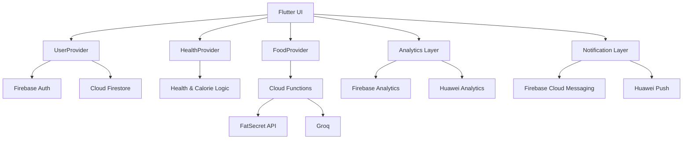
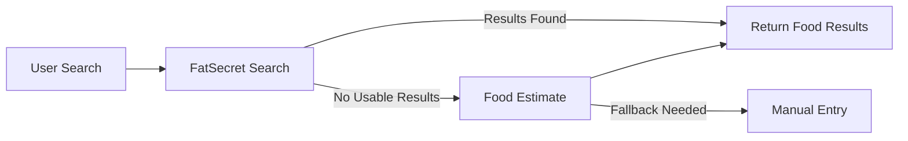

<div align="center">

# 🥗 NUDGE

### Nutrition & Coaching Platform

A cross-platform nutrition and coaching application built with **Flutter, Firebase and Cloud Functions**.

<br/>


<br/><br/>


</div>

---

## Overview

**NUDGE** is a nutrition and coaching application designed to bring food tracking, personalized guidance and everyday health workflows into a single cross-platform experience.

The application combines a Flutter client with Firebase infrastructure, Cloud Functions and external services to provide food search, meal tracking, coaching, notifications and analytics.

The project is designed around a clear separation between the application layer, backend services and external integrations.

---

## Preview

> Screenshots will be added here.

<!--

Create:

docs/screenshots/home.png
docs/screenshots/food.png
docs/screenshots/search.png
docs/screenshots/coach.png

Then replace this comment with:

<p align="center">
  
  
  
  
</p>

-->

---

## Features

<table>
<tr>

<td width="50%" valign="top">

### 👤 Authentication & Profile

- Firebase Authentication
- Google Sign-In support
- User session management
- Profile lifecycle
- Personalized user data

</td>

<td width="50%" valign="top">

### 🍽️ Food Tracking

- Food search
- Meal management
- Daily nutrition summaries
- Manual food entry
- FatSecret integration
- Intelligent fallback when search results are unavailable

</td>

</tr>

<tr>

<td width="50%" valign="top">

### 💬 Coaching

- Integrated coaching interface
- Cloud-based coaching requests
- Groq-backed language model integration
- Configurable model selection

</td>

<td width="50%" valign="top">

### 🔔 Notifications

- Remote push notifications
- Notification deep links
- Route-aware payload handling
- Firebase Cloud Messaging support
- Huawei Push integration

</td>

</tr>

<tr>

<td width="50%" valign="top">

### 📊 Analytics

- Firebase Analytics
- Huawei Analytics
- Event-based analytics architecture
- User and application interaction tracking

</td>

<td width="50%" valign="top">

### ☁️ Backend

- Firebase Cloud Functions
- Shared authentication handling
- Shared CORS behavior
- Standard API error format
- External API integrations

</td>

</tr>
</table>

---

## Tech Stack

<div align="center">

### Application


<sub>Flutter · Dart</sub>

<br/><br/>

### Backend & Cloud


<sub>Firebase · Cloud Functions · Node.js</sub>

<br/><br/>

### Services

`Firebase Auth` · `Cloud Firestore` · `Firebase Messaging` · `Firebase Analytics`

<br/>

`FatSecret API` · `Groq` · `Huawei Analytics` · `Huawei Push`

</div>

---

## Application Architecture

NUDGE separates application state, platform services and backend integrations into clearly defined layers.



---

## State Management

The application uses Provider-based state management.

### `UserProvider`

Responsible for:

- Authentication
- Session state
- User profile lifecycle

### `HealthProvider`

Responsible for:

- BMR calculations
- Calorie targets
- Activity-based calculations

### `FoodProvider`

Responsible for:

- Food search
- Search fallback logic
- Meal CRUD operations
- Daily summary orchestration

---

## Application Flow

The main application navigation is organized around four primary areas:

```text
Home
 │
 ├── Food
 │
 ├── Coach
 │
 └── Profile
```

Authentication and onboarding use named routes.

After authentication, the main application uses a shell-based navigation structure.

Notification deep links are normalized before navigating users to the corresponding application area.

---

## Food Search Flow

Food search uses a fallback-oriented architecture.



The primary search source is **FatSecret**.

If the upstream service cannot return usable results, the application can fall back to food estimation while keeping manual entry available.

---

## Backend API

Backend services are implemented using **Firebase Cloud Functions**.

Current public endpoints:

| Endpoint | Purpose |
|---|---|
| `fatsecretSearch` | Search food data through FatSecret |
| `foodEstimate` | Estimate food information when required |
| `coachChat` | Handle coaching conversations |

---

## API Design

Shared HTTP handling provides:

- CORS behavior
- Authentication handling
- Standard error responses
- Stable JSON response structures

Handled API errors follow this format:

```json
{
  "error": true,
  "code": "some_code",
  "message": "Human-readable message"
}
```

---

## LLM Integration

Groq is used as the language model provider for the current application backend.

Models are configuration-driven instead of being hardcoded directly into application logic.

Supported configuration values include:

```env
GROQ_API_KEY=
COACH_MODEL=
ESTIMATE_MODEL=
TRAINING_MODEL=
PERFORMANCE_MODEL=
```

The user-facing application currently exposes the coaching and food-estimation flows.

Some additional workers remain internal to the project.

---

## Firebase

Firebase provides the core cloud infrastructure for NUDGE.

### Authentication

Firebase Authentication manages user identity and sessions.

### Firestore

Cloud Firestore stores application and user data.

User documents and nested data are restricted to their respective owners through Firestore security rules.

### Cloud Functions

Cloud Functions act as the backend integration layer between the Flutter application and external services.

### Messaging

Firebase Cloud Messaging is used as one of the push notification providers.

### Analytics

Firebase Analytics is integrated through a shared analytics abstraction.

---

## Notification Architecture

Notification payloads follow a common contract.

```json
{
  "type": "string",
  "route": "home | food | coach | profile",
  "entityId": "optional",
  "title": "optional",
  "body": "optional"
}
```

Core notification operations include:

```text
initialize()
registerToken(provider, token)
handleForegroundMessage(payload)
handleNotificationOpen(payload)
```

Push tokens are associated with authenticated users.

---

## Analytics

Analytics are implemented through a shared event interface.

Examples of tracked events include:

```text
login
sign_up
profile_completed
food_search
food_search_fallback
food_search_result
food_added
coach_chat_opened
coach_reply_received
notification_opened
```

The analytics architecture can send events to multiple analytics providers.

---

## Huawei Support

The project contains Huawei-specific integrations for supported platforms.

Current Huawei integration includes:

- Platform capability detection
- Huawei Analytics
- Huawei Push token handling
- Huawei push open-message handling

Huawei Auth and Huawei Billing are not part of the current application scope.

---

## Project Structure

```text
NUDGE/
│
├── android/
├── ios/
├── web/
├── windows/
├── macos/
├── linux/
│
├── lib/
│   ├── providers/
│   ├── screens/
│   ├── services/
│   └── ...
│
├── functions/
│   ├── package.json
│   ├── smoke_check.js
│   └── ...
│
├── docs/
│
├── firestore.rules
├── firebase.json
├── firebase.flutterfire.json
├── pubspec.yaml
└── README.md
```

Flutter application startup responsibilities are centralized in:

```text
lib/services/app_bootstrap.dart
```

The bootstrap layer handles:

- Firebase initialization
- Firestore network initialization
- Platform capability detection
- Analytics initialization
- Notification initialization

---

## Getting Started

### Requirements

Before running the project, make sure you have:

- Flutter SDK
- Dart SDK
- Node.js
- Firebase project configuration
- Required service credentials

---

### Clone Repository

```bash
git clone https://github.com/M0NAREKS/NUDGE.git
cd NUDGE
```

---

### Install Flutter Dependencies

```bash
flutter pub get
```

---

### Install Cloud Function Dependencies

```bash
cd functions
npm install
cd ..
```

---

## Run

### Web

```bash
flutter run -d chrome
```

### Android

```bash
flutter run
```

---

## Build

### Web

```bash
flutter build web
```

### Android Debug APK

```bash
flutter build apk --debug
```

---

## Windows Android Development Note

On some Windows systems, Flutter Android builds can fail when the project path contains non-ASCII characters.

The repository includes a helper script that creates an ASCII-only junction path before running Flutter.

```powershell
powershell -ExecutionPolicy Bypass -File .\tooling\run_android_ascii_path.ps1
```

Example:

```powershell
powershell -ExecutionPolicy Bypass -File .\tooling\run_android_ascii_path.ps1 -FlutterArgs run,-d,windows
```

---

## API Smoke Test

A lightweight API smoke test is available under:

```text
functions/smoke_check.js
```

Configure the environment:

```bash
cd functions

set NUDGE_BASE_URL=https://us-central1-fitcoach-13e40.cloudfunctions.net
set NUDGE_ID_TOKEN=your_firebase_id_token

npm run smoke:api
```

The smoke test checks scenarios such as:

- CORS preflight
- Unauthenticated requests
- Standard error responses
- Authenticated endpoint behavior

---

## Verification

Recommended project checks:

```bash
flutter analyze
flutter test
flutter build web
flutter build apk --debug
```

---

## Testing Focus

The test suite currently focuses on areas including:

- FatSecret result mapping
- Food-search fallback behavior
- Provider state updates
- Notification route normalization
- Application shell navigation
- Responsive widget behavior

---

## Security

Sensitive credentials should never be stored directly in the client application or committed to the repository.

External service credentials such as FatSecret and Groq credentials are intended to be consumed through backend services and environment configuration.

Firestore access is restricted through repository-owned security rules.

---

## Current Scope

The main user-facing application currently focuses on:

- User authentication
- Nutrition tracking
- Food search
- Meal management
- Coaching
- Notifications
- Analytics
- Cross-platform application infrastructure

Additional internal workers such as training and performance modules are not currently exposed as public application endpoints.

---

## Roadmap

Potential future development areas:

- Expanded coaching capabilities
- Improved nutrition insights
- Additional health tracking
- More comprehensive dashboards
- Expanded platform support
- Improved notification personalization
- Additional external integrations

---

## License

This project is licensed under the **Apache License 2.0**.

See the [`LICENSE`](LICENSE) file for details.

---

<div align="center">

## NUDGE

**Nutrition. Coaching. One experience.**

Built with Flutter & Firebase.

<br/>

<a href="https://github.com/M0NAREKS">
  
</a>

</div>
